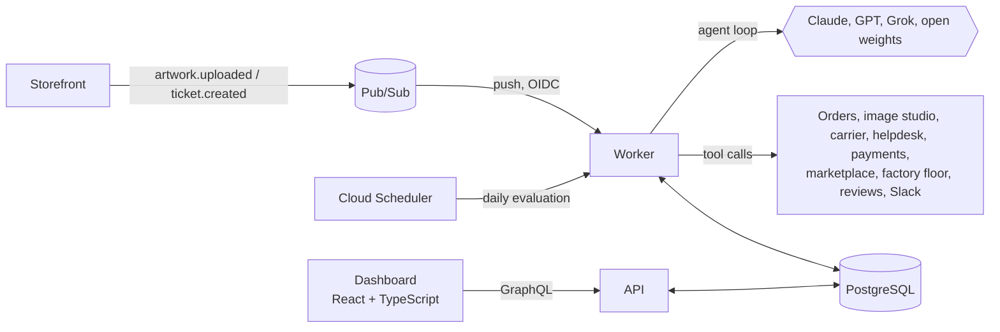

# Pressroom

**Hire, run, measure and retire a crew of AI agents for a custom print shop.**

Pressroom is the platform an AI operations team would use at a company that
prints custom stickers, labels, magnets, buttons, packaging and t-shirts, with
free online proofs, image tools (background removal, upscaling, vectorization)
and free worldwide shipping. It runs autonomous agents that do real work
(pre-flighting artwork, settling damage claims from a photo, screening
marketplace designs, rescuing production jobs that would ship late, turning
reviews into defect reports), connects them to internal and third-party
tools, measures whether each one is worth its cost, and removes the ones that
do not deliver.

Built with **Go, TypeScript, GraphQL, PostgreSQL and Google Cloud**, and model
agnostic: **Claude, OpenAI, Grok and open-weights models** plug in behind one
interface, and new releases are adopted through champion/challenger
experiments on live traffic.



## What the role asks for, and where it lives

| The job | Pressroom |
| --- | --- |
| Build agents that run on their own and do meaningful work | [The executor](internal/app/executor.go) runs a model-and-tools loop with budgets, checkpoints every step, resumes after crashes and pauses for a human before refunds or customer emails. Runs start from Pub/Sub events, the API or the CLI. |
| Strong with Claude, OpenAI, Grok and open source | [Model adapters](internal/adapter/llm): Claude through the official Anthropic Go SDK (adaptive thinking, prompt caching, server-side refusal fallbacks), and one Chat Completions adapter for OpenAI, xAI Grok and self-hosted vLLM/Ollama. |
| Identify where agents can help; work with department leads | [Intake](web/src/pages/IntakePage.tsx): leads submit repetitive work, scored by hours per week x feasibility (data sensitivity and cost of mistakes). Shipping an opportunity links it to the agent that now does it. |
| Connect agents to third-party and internal tools | A [tool registry](internal/adapter/tools/registry.go) with JSON Schema validation, per-agent allow-lists, idempotent side effects and an approval flag. 27 print-shop tools ship with it, from order lookups to the factory floor ([the crew and its tools](docs/agents.md)). |
| Measure results and remove agents that don't deliver | [Scorecards](internal/domain/scorecard.go) (success, human acceptance, cost, hours saved, net value) and a [retirement policy](internal/domain/policy.go): miss targets once, probation; twice, retired. Evaluated daily by Cloud Scheduler. |
| Test new tools and models as they ship and adopt what works | [Experiments](internal/domain/experiment.go) route a share of an agent's runs to a challenger model and promote it only if it matches quality and nets more value per run. |
| Advise others on AI capabilities | The dashboard shows every agent's job description, tools, cost and results side by side, and the models catalog lists prices per provider. |
| Go, TypeScript, GraphQL, Postgres, GCP | Go services, a TypeScript dashboard with types generated from the GraphQL schema, PostgreSQL as store and queue, Terraform for Cloud Run, Cloud SQL, Pub/Sub, Scheduler and Secret Manager. |

## Quick start

Requirements: Docker and make. No API keys needed: without them every agent
runs on a deterministic **sandbox model** that exercises the same loop, tools
and approvals.

```bash
make up
```

Open <http://localhost:3300> (set `WEB_PORT` to change it). The seed loads
thirteen agents across seven departments (a founding crew of five with a month
of history, and eight new hires) and fourteen fresh events. Within a few
seconds the worker has processed them: six runs are waiting in **Approvals**
(a refund, a reprint, two emails, a production reroute and a deal), a
champion/challenger experiment is ready to conclude on **Support Triage**, and
**Evaluate crew** puts **Reorder Nudger** on probation because reviewers throw
most of its emails away.

To use real models, export any of `ANTHROPIC_API_KEY`, `OPENAI_API_KEY`,
`XAI_API_KEY` or `OPEN_SOURCE_BASE_URL` before starting. In the default `auto`
mode each provider is used when its key is present and the sandbox covers the
rest.

Local development without containers:

```bash
make db seed        # Postgres in Docker, migrations and demo data
make dev-api        # GraphQL on :8080 (GraphiQL at /)
make dev-worker     # queue consumer and Pub/Sub endpoint on :8081
make dev-web        # dashboard on :5173
```

Send an event the way the storefront would:

```bash
go run ./cmd/pressroomctl dispatch ticket.created '{"ticketId":"T-9001","orderId":"ORD-1046","message":"Where are my buttons?"}'
```

## See it work: business scenarios

Nine Postman scenarios walk through what Pressroom is for, with real API
calls and assertions, and print the business outcome of each one:

| Scenario | Outcome of a run on the sandbox model |
| --- | --- |
| Artwork becomes a proof on its own | A low-resolution logo is fixed and proofed with no human involved, for about $0.04 |
| Refunds wait for a human | The agent drafts the reply and stops before the refund until a lead approves; the approver is on record |
| A denied action never runs | The refund never executes; the agent is told why and still closes the ticket |
| A cheaper model earns the job | Grok 4 Fast matches Claude Opus 5 on these tickets at about 1/30 of the cost and is promoted |
| An agent that does not deliver is let go | 20 error-free runs, 20% of the output kept: probation, then retirement |
| From intake request to working agent | A lead's request is scored, approved, becomes an agent and is marked shipped |
| API errors a client can act on | Stable codes and field paths, nulls for missing objects, nothing internal leaked |
| A photo settles a damage claim | The agent reads the photo as a misprint, proposes reprinting exactly 40 stickers, and after one approval drafts the reply and tells the factory |
| A flagged design is never published | Clean designs go live on their own; fan art of a protected character is held, even by an agent told to publish everything |

```bash
make up          # in one terminal
make scenarios   # in another; S="02 Refunds wait for a human" runs one
```

They are stored in Postman's Native Git format (Collection v3 YAML) under
[`postman/`](postman), so the Postman desktop app opens them straight from the
repository. [docs/scenarios.md](docs/scenarios.md) has a diagram of every
scenario and how to turn one into a Postman Flow. CI runs them against a fresh
stack on every push.

## Architecture: clean architecture, not layered

The decision and its trade-offs are in [ADR 0001](docs/adr/0001-clean-architecture.md).
In short: this product's value is in integrations that change constantly
(model vendors, tools) and in rules that must not (budgets, approvals, the
retirement policy). Clean architecture keeps the first at the edges and the
second in a domain package that imports only the standard library.

```
cmd/                   api, worker, pressroomctl: thin mains
internal/domain        entities, value objects, policies (stdlib only)
internal/port          interfaces the use cases own
internal/app           use cases: agents, runs, executor, worker, evaluation, experiments, intake
internal/adapter/      llm, tools, postgres, graphql, httpserver, events
internal/bootstrap     composition root: the only place that knows every concrete type
internal/platform      config, structured logging, auth
web/                   React + TypeScript dashboard
deploy/terraform       Google Cloud infrastructure
```

[docs/architecture.md](docs/architecture.md) walks through the agent loop, the
lifecycle state machines, and maps every **SOLID principle** and **design
pattern** to the code that applies it. The short version:

| Pattern | Where |
| --- | --- |
| Adapter | [Anthropic](internal/adapter/llm/anthropic.go#L34), [Chat Completions](internal/adapter/llm/openaicompat.go#L34), [Postgres repositories](internal/adapter/postgres) |
| Strategy | [`port.LanguageModel`](internal/port/port.go#L156) chosen per run by the [Router](internal/adapter/llm/router.go#L34) |
| Decorator | [Retrying and Logging](internal/adapter/llm/decorators.go#L28) models, [context log handler](internal/platform/logging/logging.go#L75) |
| Repository and Unit of Work | [ports](internal/port/port.go#L28), [`WithinTx`](internal/adapter/postgres/db.go#L97) |
| Specification and Composite | [retirement rules](internal/domain/policy.go#L12) combined with [`AllOf`](internal/domain/policy.go#L70) |
| State machine | [agent](internal/domain/agent.go#L23) and [run](internal/domain/run.go#L24) transition tables |
| Memento | [provider state](internal/domain/message.go#L41) carried opaquely in the transcript |
| Observer | [domain events](internal/domain/events.go#L7) and the [event bus](internal/adapter/events/bus.go#L27) |
| Registry and Factory | [tool registry](internal/adapter/tools/registry.go#L71), [`Standard`](internal/adapter/tools/standard.go#L19), [`buildModels`](internal/bootstrap/bootstrap.go#L108) |
| Chain of Responsibility | [HTTP middleware chain](internal/adapter/httpserver/middleware.go#L20) |
| Notification | [`Validator`](internal/domain/validation.go#L14) collects every field error in one pass |
| Data Loader | [per-request batching](internal/adapter/graphql/loaders.go#L17) against N+1 queries |

## API design, validation and error handling

The GraphQL contract is [schema.graphqls](internal/adapter/graphql/schema.graphqls);
conventions and examples are in [docs/api.md](docs/api.md).

- **Two kinds of errors.** Mutations return a payload with `userErrors`
  (`field` path, stable `code`, message) for anything the client can fix:
  invalid input, stale versions, forbidden state changes. Top-level GraphQL
  errors are reserved for the rest and never leak internals; unexpected
  failures come back as `INTERNAL` with a request ID that matches the logs.
- **Validation in layers.** The dashboard validates with zod for instant
  feedback; GraphQL enforces types and custom scalars; the domain validates
  every field in one pass and is the source of truth; Postgres check
  constraints guard against anything that bypasses the application; tool
  arguments produced by a model are validated against JSON Schema before any
  tool runs, and schema errors go back to the model so it can correct itself.
- **Money** is a `USD` scalar carried as a decimal string and stored as
  integer micro-dollars, never a float.
- **Idempotency** on `startRun` and on every Pub/Sub message; side-effecting
  tools derive an idempotency key from the run and call ID.
- **Optimistic concurrency** (`expectedVersion`) on agents and runs.
- **Cursor pagination** on runs, a **complexity limit**, per-request
  **DataLoaders**, and failure classification: transient errors (429, 5xx,
  timeouts) retry with backoff; permanent ones fail the run with a reason.

## Tests

```bash
make test               # unit tests, no database
make test-integration   # plus repository, queue and GraphQL end-to-end tests on Postgres
make test-web           # dashboard typecheck and unit tests
```

The domain rules and the agent loop are covered with table-driven tests and
in-memory fakes (budgets, approvals, denials, guardrails, crash recovery,
cancellation races). The Claude and Chat Completions adapters are tested
against their wire formats on a local HTTP server, including the replay of
Claude's thinking blocks between tool turns. Integration tests cover `SKIP LOCKED` claiming
with concurrent workers, optimistic locking and the GraphQL error contract.
CI runs all of it, checks that generated GraphQL code on both sides matches
the schema, builds the images and validates the Terraform.

## Deploying to Google Cloud

```bash
# 1. Secrets Terraform should not see (repeat for openai-api-key, xai-api-key,
#    slack-webhook-url and pressroom-api-token)
printf %s "$ANTHROPIC_API_KEY" | gcloud secrets create anthropic-api-key --data-file=-

# 2. Infrastructure; services start on a placeholder image
terraform -chdir=deploy/terraform init -backend-config="bucket=<state-bucket>"
terraform -chdir=deploy/terraform apply -var-file=example.tfvars

# 3. Build, migrate and roll out the real images
gcloud builds submit --config cloudbuild.yaml \
  --substitutions=_API_URL="$(terraform -chdir=deploy/terraform output -raw api_url)"
```

Terraform creates Cloud Run services for the API, the private worker (always
warm, internal ingress, invoked only by Pub/Sub and Cloud Scheduler with OIDC)
and the dashboard, a migration job, Cloud SQL for PostgreSQL 17, the
storefront events topic with a dead-letter topic, the daily evaluation job,
and one service account per workload. Model API keys are Secret Manager
secrets created outside Terraform, so their values never enter state. Cloud
Build builds the images, runs migrations as a Cloud Run job, then rolls out.

## Roadmap

- MCP client adapter so agents can use tools served over the Model Context Protocol.
- Offline eval sets per agent, run against a challenger before it sees live traffic.
- OpenTelemetry traces across API, worker, model calls and tools.
- Cloud SQL IAM database authentication instead of a password.

## License

[MIT](LICENSE)
