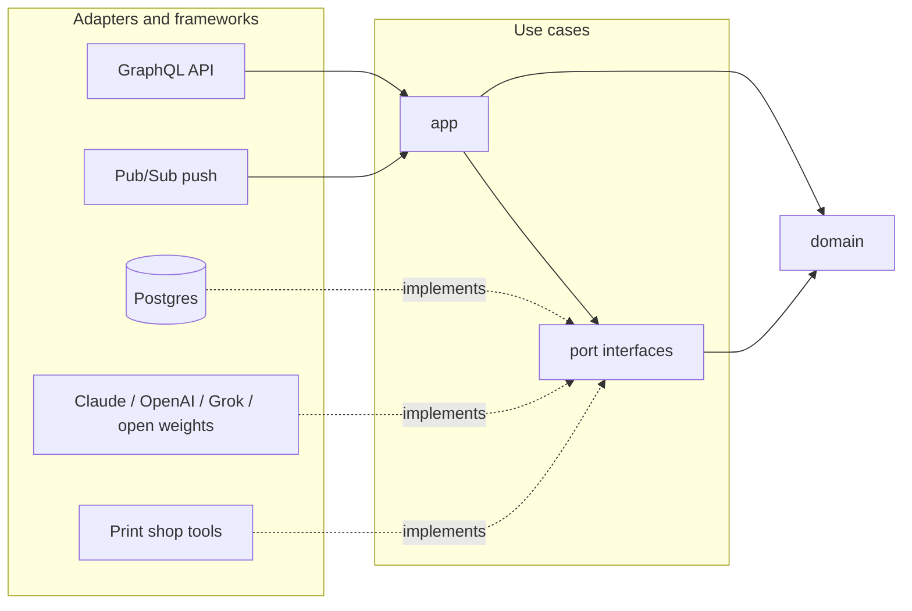

# ADR 0001: Clean architecture over a layered architecture

- Status: accepted
- Date: 2026-09-27

## Context

Pressroom runs a crew of AI agents for a custom printing business: agents that
check artwork before it goes to press, triage support tickets, chase stuck
shipments and nudge customers to reorder. Four forces shape the code:

1. **Model churn is the job, not an edge case.** The team is expected to test
   Claude, OpenAI, Grok and open-weights releases as they ship and adopt the
   ones that win on real work. A vendor swap has to be a configuration change,
   and trying two vendors side by side (an experiment) has to be routine.
2. **Agents are only as useful as the tools they reach.** Tools wrap internal
   systems (the order database, the image studio that removes backgrounds and
   vectorizes artwork) and third-party services (carriers, the helpdesk,
   Slack). That list grows every month.
3. **Several ways in.** The same use cases are reached from the GraphQL API
   used by the dashboard, Pub/Sub push events (`artwork.uploaded`,
   `ticket.created`), Cloud Scheduler jobs, a queue worker and a CLI.
4. **The business rules are the product.** Budgets, human approval for
   refunds, and the policy that puts an underperforming agent on probation
   and then retires it must be correct, reviewable and testable without a
   database, a network or an API key.

## Options considered

**Layered (n-tier).** Presentation calls business services, which call a data
access layer. Simple and familiar. The dependency arrow points down, so the
business layer imports the data layer and, in practice, whatever SDK the data
layer exposes. With five model providers and a dozen tools, vendor types
would leak into the services that hold our rules, and every new provider
would mean editing those services.

**Clean architecture (ports and adapters).** The domain sits in the middle
and depends on nothing. Use cases depend on the domain and on *ports*,
interfaces they own and define in their own terms. Adapters (Postgres,
Anthropic, OpenAI-compatible APIs, GraphQL, Pub/Sub) implement or call those
ports from the outside. All source dependencies point inward.

## Decision

Use clean architecture, organised as:

```
cmd/                     composition roots: wire adapters into use cases
internal/domain          entities, value objects, policies (stdlib only)
internal/port            interfaces the use cases need (repositories, model, tools, queue)
internal/app             use cases: agents, runs, the executor loop, evaluation, experiments
internal/adapter/...     postgres, llm, tools, graphql, httpserver, events
internal/platform        config, logging, clock
```



### Why this fits Pressroom

- **Vendor churn stays at the edge.** `port.LanguageModel` speaks in
  provider-neutral messages. Adding a provider is a new adapter plus a router
  entry; the executor, the experiment logic and the scorecards do not change
  (Open/Closed, Dependency Inversion).
- **Tools plug in the same way.** The executor sees `port.ToolRegistry` and
  `domain.ToolSpec`. Whether a tool hits Postgres, an internal HTTP service or
  Slack is invisible to it.
- **One set of use cases, many entry points.** GraphQL resolvers, the Pub/Sub
  handler and the CLI call the same services, so validation and approval rules
  cannot drift between them.
- **Fast, honest tests.** The agent loop is tested with a scripted model and
  in-memory repositories in milliseconds. Postgres adapters get their own
  integration tests against a real database.
- **Auditable rules.** The retirement policy, budgets and lifecycle state
  machines live in `internal/domain` with no I/O, so a reviewer can read the
  exact rule that retired an agent.

## Consequences

Costs we accept:

- **Mapping code.** GraphQL models and Postgres rows are mapped to domain
  types by hand. It is boring code, but it is what keeps an API field rename
  or a column change from rippling into the rules.
- **More interfaces.** Ports exist only at real boundaries (storage, models,
  tools, queue, clock, events). There is no interface per struct and no
  interface with a single in-process caller.

Guardrails that keep the architecture honest:

- `internal/domain` imports only the standard library.
- `internal/app` never imports `internal/adapter/...`.
- Adapters never import each other; `cmd/*` is the only place that knows
  every concrete type.

## When layered would have been the better call

A CRUD back office with one database, one UI and no external integrations.
There the extra ports and mapping would cost more than they return. Pressroom
is the opposite case: its value is in integrations and rules that must
survive vendor changes.
