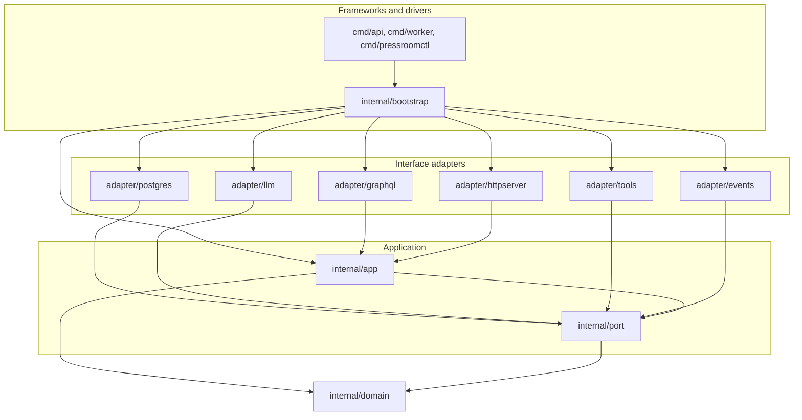
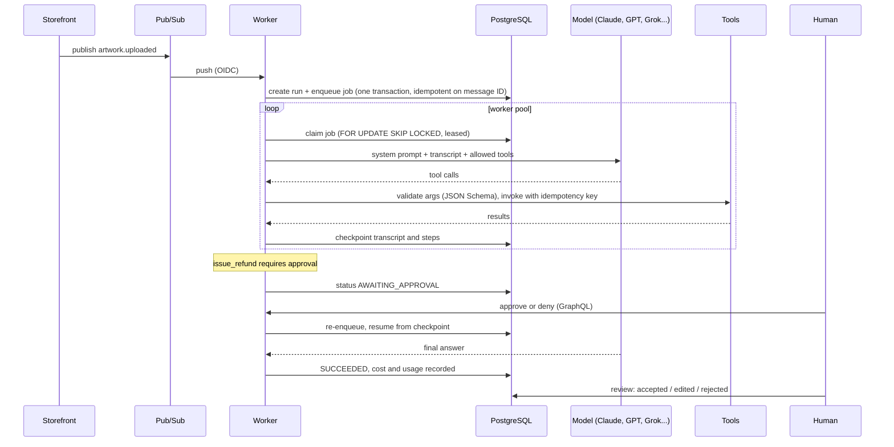
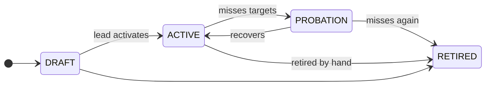
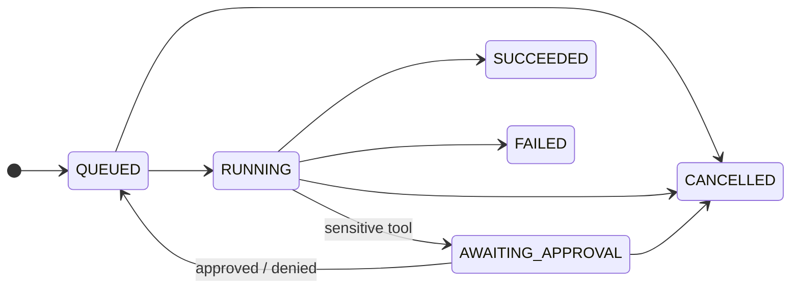

# Architecture

Pressroom follows clean architecture ([ADR 0001](adr/0001-clean-architecture.md)
explains why it beat a layered design). This page shows how the pieces fit,
follows one run through the system, and maps the SOLID principles and design
patterns to the code that applies them.

## The dependency rule

Arrows are source dependencies and all of them point inward:

- `internal/domain` imports only the standard library.
- `internal/app` depends on the domain and on `internal/port`, never on an adapter.
- Adapters implement ports (Postgres, models, tools, events) or call use cases
  (GraphQL, HTTP). They never import each other.
- `internal/bootstrap` is the composition root: the one place that picks
  concrete types and wires them together.

## One run, end to end

A customer uploads artwork; the storefront publishes `artwork.uploaded`.

The executor ([internal/app/executor.go](../internal/app/executor.go)) is the
heart of it. Each iteration it:

1. Resolves pending tool calls from the previous model turn. A call outside
   the agent's allow-list gets an error result; a call that needs approval
   pauses the run; everything else runs with a timeout and an idempotency key.
2. Checks the step and cost budget.
3. Checkpoints, then asks the model for the next turn.
4. Records usage and cost, then either loops (tool calls), succeeds (an
   answer) or fails (refusal, token limit, permanent error).

Transient failures (rate limits, overloaded providers, timeouts) leave the run
`RUNNING` and hand the job back to the queue with backoff. Because every step
is checkpointed, a retry or a crashed worker's replacement continues from the
last saved step and never repeats a finished tool call.

## Lifecycles

Both are transition tables in the domain
([agent](../internal/domain/agent.go#L23), [run](../internal/domain/run.go#L24)),
so a new state is a new row, not a change to every method that moves one.

## SOLID in this codebase

| Principle | How it shows up |
| --- | --- |
| **Single Responsibility** | Each use-case service owns one area: [agents](../internal/app/agents.go), [runs](../internal/app/runs.go), the [executor](../internal/app/executor.go), the [worker](../internal/app/worker.go), [evaluation](../internal/app/evaluation.go), [experiments](../internal/app/experiments.go), [intake](../internal/app/opportunities.go). Resolvers only translate transport types. Each tool does one thing. |
| **Open/Closed** | New model providers register with the [Router](../internal/adapter/llm/router.go#L34); new tools register with the [Registry](../internal/adapter/tools/registry.go#L70); new retirement rules compose with [`AllOf`](../internal/domain/policy.go#L70); new states are rows in a transition table. None of these edit existing code. |
| **Liskov Substitution** | Every `port.LanguageModel` (Claude, Chat Completions, sandbox, and the decorators wrapping them) honours the same contract, including the error contract: retryable failures are `*port.TransientError`. The executor tests run on a scripted model; production runs on real ones. |
| **Interface Segregation** | [Ports](../internal/port/port.go) are small and client-shaped: `PriceBook` is one method, `Clock` is one method, the worker depends on a two-method `runExecutor` rather than the whole executor. |
| **Dependency Inversion** | Use cases own the interfaces they need ([port](../internal/port/port.go)) and receive implementations through constructors; only [bootstrap](../internal/bootstrap/bootstrap.go#L48) knows concrete types. |

## Design patterns

| Pattern | Where | Why here |
| --- | --- | --- |
| Adapter | [Anthropic](../internal/adapter/llm/anthropic.go#L34), [Chat Completions](../internal/adapter/llm/openaicompat.go#L34), [repositories](../internal/adapter/postgres) | Each vendor's wire format and each table layout is translated at the edge. |
| Strategy | [`port.LanguageModel`](../internal/port/port.go#L156), picked per run from the agent's `ModelRef` | Swapping Claude for Grok is data, not code. |
| Decorator | [`Retrying`, `Logging`](../internal/adapter/llm/decorators.go#L28), [log context handler](../internal/platform/logging/logging.go#L75) | One retry policy and one log format for every provider, added without touching adapters. |
| Factory | [`buildModels`](../internal/bootstrap/bootstrap.go#L106), [`tools.Standard`](../internal/adapter/tools/standard.go#L12), [`tools.Func`](../internal/adapter/tools/registry.go#L34) | Construction logic (which providers have keys, which tools exist) lives in one place. |
| Registry | [tool registry](../internal/adapter/tools/registry.go#L70) | Lookup by name, schema compiled once, one validated entry point for every call. |
| Repository | [`port.AgentRepository`, `port.RunRepository`...](../internal/port/port.go#L28) | Use cases speak in aggregates, not SQL. |
| Unit of Work | [`WithinTx`](../internal/adapter/postgres/db.go#L97) | A run and its job commit together, so there is no dual write between database and queue. |
| Specification + Composite | [rules](../internal/domain/policy.go#L12) combined with [`AllOf`](../internal/domain/policy.go#L70) | "Delivering" is a set of small, testable rules, and every failing rule contributes its reason. |
| State machine | [agent](../internal/domain/agent.go#L23), [run](../internal/domain/run.go#L24), opportunity transition tables | Illegal moves are impossible to express, not merely checked. |
| Memento | [`Message.ProviderState`](../internal/domain/message.go#L41) | Claude's thinking blocks must be replayed unchanged during a tool loop; the domain stores them without understanding them. |
| Observer | [domain events](../internal/domain/events.go#L7), [bus](../internal/adapter/events/bus.go#L27) | Slack notifications and the audit log react to approvals and retirements without the use cases knowing they exist. |
| Chain of Responsibility | [middleware `Chain`](../internal/adapter/httpserver/middleware.go#L20) | Request IDs, recovery, logging, CORS and auth compose in a fixed order. |
| Notification | [`Validator`](../internal/domain/validation.go#L14) | Forms get every field error in one response. |
| Data Loader | [loaders](../internal/adapter/graphql/loaders.go#L17) | A crew page asks for 30 scorecards in one aggregate query. |
| Optimistic locking | [`AgentRepo.Update`](../internal/adapter/postgres/agents.go#L45) | Two leads editing an agent, or a cancel racing a worker, cannot silently overwrite each other. |

## Storage

PostgreSQL is both the system of record and the work queue:

- `runs` hold the transcript as JSONB in a storage-specific shape
  ([messageRow](../internal/adapter/postgres/runs.go#L21)), so renaming a
  domain field never breaks rows written by an older release.
- `run_steps` is an append-only audit trail of every model turn, tool call and
  approval, with latency and cost.
- `run_jobs` is the queue: `FOR UPDATE SKIP LOCKED` lets many workers claim
  concurrently; leases (`locked_until`) and heartbeats hand a crashed worker's
  job to another.
- UUIDv7 identifiers are time ordered, so newest-first pages are index scans
  on the primary key, and a covering index answers scorecard aggregates
  without touching the heap.
- Check constraints and a partial unique index (one running experiment per
  agent) repeat the critical invariants at the database level.

## Observability

Logs are JSON on stdout in Cloud Logging's format (`severity`, `message`), with
the request ID and trace on every line. Each model call logs latency and
tokens; each run logs its outcome and cost; domain events double as an audit
stream. Unexpected API errors return a request ID that matches these logs.
