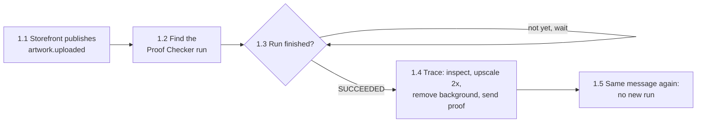
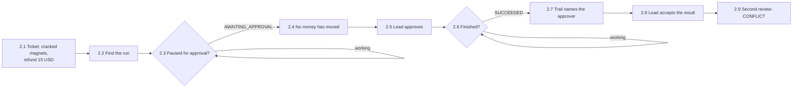
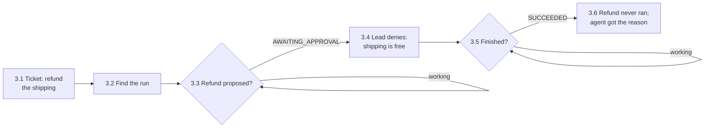
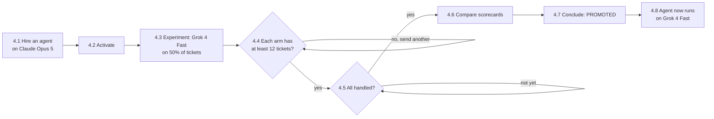
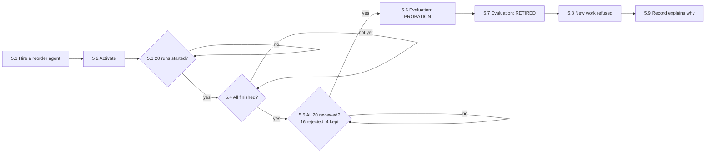
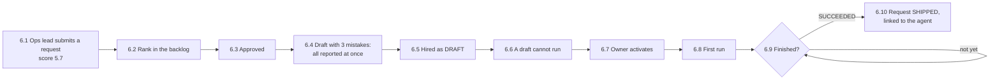
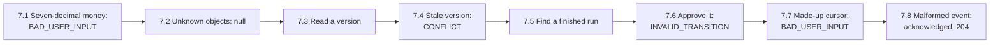

# Business scenarios

Pressroom answers the questions a company has to settle before it lets AI
agents do real work: can an agent finish a job on its own, can it act without
being trusted with money, what happens when a person says no, how do we adopt
a new model safely, what do we do with an agent nobody finds useful, and how
does a department get one in the first place.

Each question is a scenario in the Postman collection
[`postman/collections/Pressroom Scenarios`](../postman/collections/Pressroom%20Scenarios).
Every scenario is a sequence of real API calls with assertions, and ends by
printing its business outcome. The diagrams below show each one step by step;
the step numbers match the request names in Postman.

| # | The question | What the run shows |
| --- | --- | --- |
| 1 | Can an agent finish a job with no human involved? | An uploaded logo is inspected, upscaled, cleaned up and sent to the customer as a proof, in seconds, for a few cents. |
| 2 | Can it act on its own without being trusted with money? | The agent researches a damaged-order ticket and drafts the reply, then stops before refunding until a lead approves. The approver is on record. |
| 3 | What happens when a person says no? | The refund never runs. The agent is told why and still finishes the ticket. |
| 4 | How do we adopt a new model on evidence? | Half the tickets go to Grok 4 Fast. Same success rate, about 30 times cheaper per ticket, so it is promoted. |
| 5 | What happens to an agent that does not deliver? | 20 runs without an error, but reviewers keep 20% of the output: probation, then retirement, then no more work. |
| 6 | How does a department get an agent, and how do we prove it shipped? | A lead's request is scored and ranked, approved, turned into an agent, and marked shipped with that agent linked. |
| 7 | What does a developer get when something is wrong? | Stable error codes, field paths, nulls for missing objects, and no internal details. |

## Run them

The scenarios expect the stack with its demo data and no model API keys, so
every agent uses the free, deterministic sandbox model.

### From the terminal

```bash
make up                                          # in one terminal
make scenarios                                   # in another: all seven
make scenarios S="02 Refunds wait for a human"   # just one
```

`make scenarios` runs the [Postman CLI](https://learning.postman.com/docs/postman-cli/postman-cli-overview)
through `npx` (Node 20 or newer; no Postman account needed). It fails if an
assertion fails, and also if any step did not run: the CLI silently skips a
request file it cannot parse, so `scripts/scenarios.sh` checks every step
number against the files on disk. CI runs the same command against a fresh
stack on every push.

### From the Postman desktop app

The collection is stored in Postman's Native Git format (Collection v3 YAML),
which the desktop app opens directly from the repository:

1. In the sidebar, click the **Files** icon, then **Open folder**, and choose the Pressroom repository root.
2. Switch to **Local View** (bottom left). **Pressroom Scenarios** and the **Pressroom Local** environment appear.
3. Select the **Pressroom Local** environment.
4. Right-click a scenario folder and run it with the **Collection Runner**.

The "Wait for..." steps repeat themselves until the worker finishes, which
only happens in the Collection Runner. Sent by hand, a request runs once.
Edits made in the app are saved straight back to the YAML files, ready to
commit.

## The scenarios

### 1. Artwork becomes a proof on its own



A 600 px logo ordered at 3 x 3 inches is 200 DPI; stickers need 300. The
agent works that out, upscales 2x, removes the background so the die line
follows the shape, and sends the free proof. It skips vectorizing because the
inspection said it was not needed. Pub/Sub delivering the same message twice
does not start a second run.

### 2. Refunds wait for a human



### 3. A denied action never runs



### 4. A cheaper model earns the job



Each run is assigned to an arm by hashing its ID, so the split is close to
50/50 and a retried run never switches models. The challenger wins only if it
matches the champion's success and acceptance rates (within two points) and
nets more value per run.

### 5. An agent that does not deliver is let go



The evaluation normally runs every morning from Cloud Scheduler. It covers the
whole crew, so running this scenario also evaluates the demo agents.

### 6. From intake request to working agent



### 7. API errors a client can act on



## Turning a scenario into a Postman Flow

Postman Flows are the drag-and-drop version of these diagrams. The desktop app
stores each Flow as a JSON file under `postman/flows/` when the repository is
open in Local View, so a Flow you build is committed like any other file.

The repository does not ship hand-written Flow files: Postman does not publish
the Flow file format, Flows point at requests by internal IDs, and running one
from the command line (`postman flows run`) needs an Enterprise plan. Building
one in the app takes a few minutes per scenario:

1. Create a Flow in the workspace and name it after the scenario.
2. Add one request block per step, in step order, choosing the requests from
   **Pressroom Scenarios**, and connect each block's success output to the next.
3. For a "Wait for..." step, add a condition on `data.run.status` after the
   request: while it is `QUEUED` or `RUNNING`, go through a delay back into the
   same request; otherwise continue.
4. Where a step needs a value from an earlier response (the run ID, the agent
   ID), select that field from the response and connect it to the next block.
5. End with an output block that shows the outcome: cost, duration, decision.

The collection's own tests keep running inside the Flow, so it fails the same
way `make scenarios` does.

## Environment

`postman/environments/local.environment.yaml`:

| Variable | Default | Meaning |
| --- | --- | --- |
| `apiUrl` | `http://localhost:8080` | GraphQL API |
| `workerUrl` | `http://localhost:8081` | Worker, for Pub/Sub push events |
| `actor` | `cx-lead@example.com` | Operator recorded for approvals and reviews |
| `pollMs` | `500` | Wait between polls |
| `maxPolls` | `120` | Polls before a wait step gives up |

To start from clean demo data: `make down && make up`.
